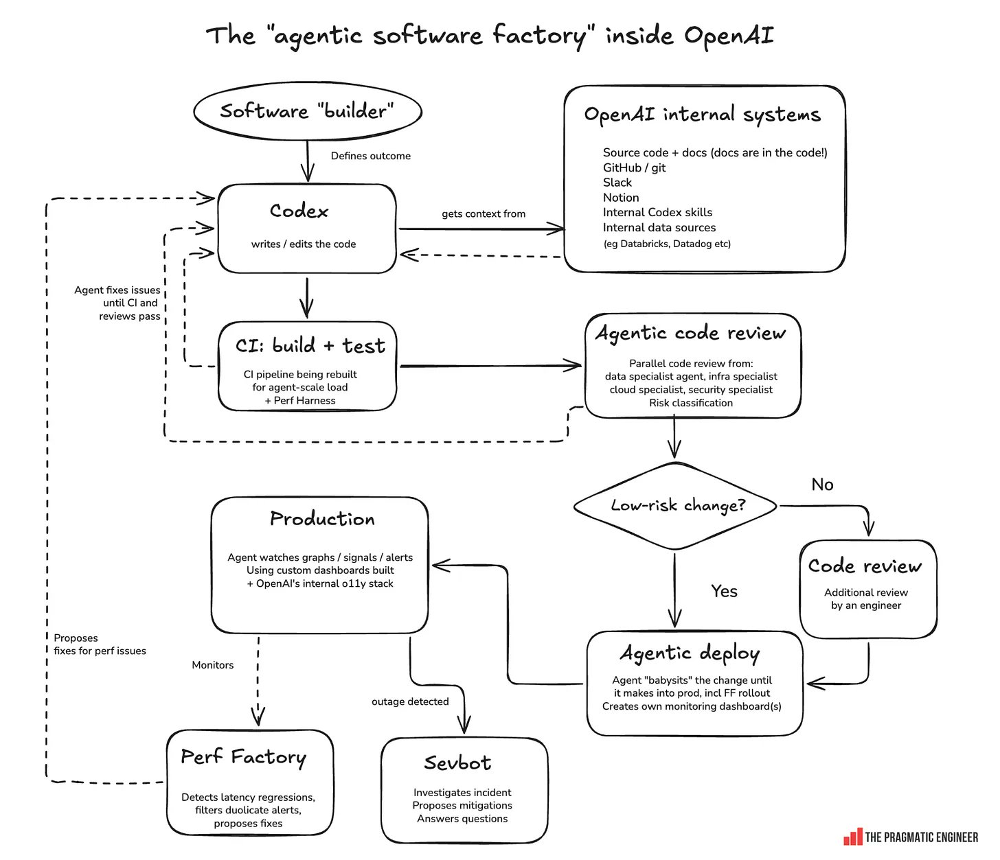

# Fábrica agêntica de software: como adaptar o ciclo usado na OpenAI

Uma fábrica agêntica de software usa agentes em várias etapas do ciclo de
engenharia. O agente implementador é apenas uma parte. Testes, revisão por
especialidade, classificação de risco, deploy acompanhado, observabilidade,
performance e resposta a incidentes formam ciclos de feedback conectados.

O diagrama abaixo foi publicado por Gergely Orosz após conversar com líderes e
engenheiros da OpenAI. Ele representa o sistema interno descrito pelas fontes,
e não uma funcionalidade pronta que aparece automaticamente ao abrir o Codex.



> Imagem: [Gergely Orosz, The Pragmatic Engineer](https://x.com/GergelyOrosz/status/2099945497377091902).
> [Abrir a imagem original](https://pbs.twimg.com/media/HSSBIdfWEAAbXl8.jpg)

## Como ler a imagem

O fluxo principal é:

```text
humano define o resultado
→ Codex reúne contexto e altera o código
→ build, testes e CI
→ revisão paralela por agentes especialistas
→ classificação de risco
→ revisão humana quando necessária
→ deploy acompanhado por agente
→ observação em produção
→ performance e incidentes alimentam novos trabalhos
```

As setas tracejadas representam retorno. Se testes ou revisores encontram um
problema, o trabalho volta ao agente implementador. Se a produção revela uma
regressão de performance, a Perf Factory propõe uma correção e reinicia o
ciclo.

## Os blocos do sistema

| Bloco da imagem | Responsabilidade |
|---|---|
| Software builder | definir problema, resultado, prioridade e critérios de sucesso |
| Codex | reunir contexto, escrever ou editar código e responder ao feedback |
| Sistemas internos | oferecer código, documentação, GitHub, Slack, Notion, skills e dados operacionais |
| CI: build + test | compilar, executar testes e avaliar performance |
| Agentic code review | revisar em paralelo por segurança, infraestrutura, dados e outras especialidades |
| Classificação de risco | decidir quais mudanças precisam de controles adicionais |
| Code review | adicionar julgamento humano às mudanças que não são de baixo risco |
| Agentic deploy | acompanhar a mudança até produção, inclusive com feature flags e dashboards próprios |
| Production | observar métricas, traces, logs, sinais e alertas |
| Perf Factory | detectar regressões de latência, eliminar alertas duplicados e propor correções |
| Sevbot | investigar incidentes, sugerir mitigações e responder perguntas |

O ganho vem do encadeamento. Uma revisão automatizada sem contexto, um deploy
sem métricas ou um bot de incidentes sem limites não forma uma fábrica.

## O que o artigo relata sobre a OpenAI

Segundo o artigo consultado:

- o Codex obtém contexto de repositórios, documentação dentro do código,
  GitHub, Slack, Notion, Databricks, Datadog, logs, skills internas e outras
  fontes;
- o agente implementador acompanha falhas de testes e atualiza a mudança até o
  CI ficar verde;
- um harness de performance pode encaminhar mudanças problemáticas para
  avaliações A/B sintéticas;
- revisores agênticos especializados analisam a mesma mudança sob perspectivas
  diferentes;
- mudanças são classificadas por risco;
- áreas que aderiram ao fluxo podem permitir aprovação automática de mudanças
  de baixo risco;
- um agente de deploy acompanha sinais de produção e pode criar seu próprio
  dashboard para aquela mudança;
- a Perf Factory investiga regressões de latência e propõe correções;
- o Sevbot reúne contexto e sugere mitigações, mas o artigo afirma que ele ainda
  não executa qualquer mitigação por conta própria;
- a infraestrutura de desenvolvimento sofreu aumentos expressivos de carga com
  o crescimento do volume de mudanças.

O artigo também diz que a versão interna do Codex possui integrações mais amplas
que o produto externo. Portanto, reproduzir o desenho exige conectar seus
próprios repositórios, documentação, telemetria e políticas.

## Princípio 1: o humano define um resultado verificável

Não comece com “melhore o sistema”. Escreva um contrato de resultado.

```markdown
# Resultado desejado

Problema:
[COMPORTAMENTO OBSERVADO]

Resultado:
[COMPORTAMENTO QUE DEVE EXISTIR]

Usuários afetados:
[QUEM E EM QUAL CONTEXTO]

Critérios de aceite:
- [CRITÉRIO VERIFICÁVEL 1]
- [CRITÉRIO VERIFICÁVEL 2]
- [CRITÉRIO VERIFICÁVEL 3]

Não objetivos:
- [ESCOPO EXCLUÍDO]

Risco conhecido:
[DADOS, PAGAMENTO, AUTENTICAÇÃO, INFRAESTRUTURA ETC.]

Plano de reversão:
[COMO VOLTAR AO ESTADO ANTERIOR]
```

O agente pode decidir detalhes rotineiros de implementação. Resultado, escopo,
risco aceitável e decisões de produto continuam com a pessoa responsável.

## Princípio 2: coloque o contexto perto do trabalho

O agente precisa encontrar respostas sem adivinhar. Para cada repositório,
organize:

```text
repositorio/
├── AGENTS.md
├── README.md
├── docs/
│   ├── architecture.md
│   ├── operations.md
│   ├── security.md
│   └── decisions/
├── runbooks/
├── src/
└── tests/
```

Documente:

- como validar uma mudança;
- quais diretórios pertencem a cada subsistema;
- como dados sensíveis devem ser tratados;
- onde estão métricas e dashboards;
- quais ações exigem autorização humana;
- como fazer rollback;
- quem responde por cada domínio.

Contexto de Slack ou Notion pode ajudar, mas não deve substituir decisões
duráveis e versionadas. Informações conflitantes precisam ser resolvidas antes
de autorizar uma mudança.

## Princípio 3: o agente implementador fecha o ciclo do CI

O pedido ao agente deve incluir implementação e correção dos problemas causados
pela própria alteração.

```text
Implemente o resultado descrito em [ARQUIVO OU ISSUE].

Antes de editar:
- leia as instruções do repositório;
- identifique os testes e contratos afetados;
- preserve mudanças não relacionadas.

Depois:
- execute as verificações pertinentes;
- corrija falhas causadas pela alteração;
- apresente o diff e os riscos materiais;
- não reduza gates de segurança para fazer a mudança passar.
```

O loop esperado é:

```text
editar
→ testar
→ interpretar falha
→ corrigir
→ testar novamente
→ apresentar evidência
```

Uma pipeline verde confirma apenas os contratos cobertos pelos testes. Ela não
prova correção de produto, segurança completa ou ausência de regressão em
produção.

## Princípio 4: revise a mudança por especialidade

Em vez de pedir uma revisão genérica várias vezes, dê uma responsabilidade
diferente a cada revisor.

| Revisor | Pergunta principal |
|---|---|
| Segurança | a mudança amplia acesso, exposição, injeção ou vazamento? |
| Dados | migrações, consistência, retenção e rollback estão corretos? |
| Infraestrutura | recursos, concorrência, capacidade e falhas foram tratados? |
| Performance | latência, memória, CPU e volume podem regredir? |
| Produto | o comportamento atende aos critérios de aceite? |
| Operações | há métricas, alertas, runbook e reversão? |
| Acessibilidade | teclado, leitores de tela, contraste e estados são utilizáveis? |

Modelo de instrução:

```text
Revise esta mudança como especialista em [DOMÍNIO].

Leia o diff, os contratos do repositório e as verificações executadas. Procure
problemas concretos que possam causar falha, perda, exposição ou comportamento
incorreto. Para cada achado, indique arquivo, linha, cenário e impacto.

Não altere o código. Não repita comentários de estilo sem efeito funcional.
```

Agentes especialistas só se tornam diferentes quando recebem contexto,
contratos e ferramentas do domínio. Mudar apenas o nome do papel tende a gerar
revisões superficiais semelhantes.

## Princípio 5: classifique risco com regras explícitas

Não deixe “baixo risco” como um julgamento invisível do modelo.

### Exemplo de matriz

| Nível | Exemplos | Caminho mínimo |
|---|---|---|
| Baixo | texto, documentação, teste isolado, refatoração sem mudança de contrato | CI + revisão agêntica + deploy gradual |
| Médio | comportamento de produto reversível, dependência, mudança de API interna | CI + especialistas + revisão humana |
| Alto | autenticação, autorização, pagamentos, migração de dados, segredo, infraestrutura crítica | revisão humana obrigatória + plano de rollback + rollout restrito |
| Crítico | ação irreversível, acesso privilegiado amplo, mudança regulada ou sem reversão testada | processo específico e aprovação nomeada |

Os critérios devem considerar:

- superfície afetada;
- reversibilidade;
- impacto financeiro;
- alcance de dados;
- mudança de permissão;
- dependências externas;
- capacidade de observar a falha;
- qualidade dos testes;
- maturidade do rollback.

Uma alteração pequena em linhas pode ser alta em risco. Uma alteração grande e
gerada pode ser de baixo risco se for isolada, reversível e bem observada.

## Princípio 6: deploy é uma fase acompanhada

O agente de deploy não deve apenas executar um comando. Ele precisa conhecer:

- versão ou commit implantado;
- grupo inicial de usuários;
- feature flag;
- métricas de sucesso;
- métricas de falha;
- duração da observação;
- limiares para parar;
- procedimento de rollback;
- pessoa responsável pela decisão.

Modelo:

```markdown
# Plano de rollout

Mudança: [VERSÃO OU COMMIT]
Escopo inicial: [CANÁRIO, 1%, EQUIPE INTERNA ETC.]
Flag: [NOME]

Sucesso:
- [MÉTRICA E LIMIAR]

Falha:
- [MÉTRICA E LIMIAR]

Janela de observação: [TEMPO]
Rollback: [COMANDO OU PROCEDIMENTO]
Responsável: [PESSOA OU EQUIPE]
```

O deploy deve parar quando um limite é ultrapassado. Expandir o rollout é uma
ação separada e auditável.

## Princípio 7: cada mudança precisa de observabilidade

Relacione o deploy com:

- logs estruturados;
- métricas de negócio e técnicas;
- traces;
- versão implantada;
- feature flag;
- coorte de usuários;
- dashboard da mudança;
- alertas com proprietário.

Sem esse vínculo, um agente observa o sistema inteiro e pode confundir uma
regressão antiga com a mudança atual.

Para cada alteração relevante, responda:

```text
qual comportamento deveria melhorar?
qual métrica deveria permanecer estável?
qual sinal indica regressão?
como ligar esse sinal ao commit e ao rollout?
```

## Princípio 8: construa uma Perf Factory pequena

Comece com um fluxo limitado e verificável:

```text
coletar métricas de produção
→ comparar versão atual com baseline
→ agrupar alertas equivalentes
→ identificar regressão provável
→ reproduzir em benchmark
→ localizar mudança candidata
→ criar proposta de correção
→ voltar ao CI normal
```

O agente não deve otimizar um benchmark desconectado dos usuários. Use traces e
cargas representativas da produção, com dados anonimizados ou sintéticos quando
necessário.

Relatório mínimo:

```markdown
# Regressão de performance

Sinal: [P50, P95, P99, CPU, MEMÓRIA ETC.]
Início observado: [DATA E VERSÃO]
Baseline: [VALOR]
Atual: [VALOR]
Coortes afetadas: [ESCOPO]
Mudança candidata: [COMMIT]
Evidência de causalidade: [TESTE OU COMPARAÇÃO]
Reprodução: [COMANDO]
Correção proposta: [RESUMO]
Riscos: [LISTA]
```

Uma correlação temporal não basta para autorizar correção ou rollback.

## Princípio 9: o bot de incidentes começa como investigador

O artigo descreve o Sevbot atual como um agente que coleta contexto, propõe
mitigações e responde perguntas. A execução permanece com uma pessoa até que
ações específicas tenham limites comprovados.

Primeira versão segura:

```text
alerta
→ abrir contexto do incidente
→ reunir mudanças recentes, métricas, logs e runbooks
→ formular hipóteses
→ sugerir mitigações com impacto e reversão
→ aguardar uma instrução explícita
→ registrar ação e resultado
```

Uma mitigação automática só deve existir para operações previamente aprovadas,
estreitas, reversíveis, observáveis e testadas em exercícios.

## Arquitetura mínima para uma equipe comum

Você não precisa reproduzir a infraestrutura da OpenAI. Uma primeira versão
pode usar:

| Camada | Implementação mínima |
|---|---|
| Resultado | issue com critérios de aceite e risco |
| Contexto | repositório + `AGENTS.md` + documentação operacional |
| Implementação | uma tarefa do Codex por mudança |
| CI | build, testes, análise estática e checks obrigatórios |
| Revisão | dois agentes especializados e um gate humano por risco |
| Deploy | pipeline existente com canário ou feature flag |
| Observabilidade | dashboard ligado à versão e alerta com proprietário |
| Performance | comparação diária de P50/P95/P99 e investigação assistida |
| Incidentes | bot somente leitura que reúne contexto e sugere ações |

## Ordem recomendada de adoção

1. Escreva contratos de resultado e critérios de aceite.
2. Organize documentação e comandos de verificação no repositório.
3. Faça o agente fechar o ciclo de build e testes.
4. Adicione revisores especializados em modo somente leitura.
5. Formalize a matriz de risco e os gates humanos.
6. Ligue cada deploy a métricas e rollback.
7. Automatize detecção e investigação de regressões.
8. Crie assistência para incidentes sem execução autônoma.
9. Amplie autonomia somente com evidência acumulada.

## Métricas da fábrica

Meça o sistema inteiro, não apenas linhas produzidas:

- tempo entre definição e primeiro diff revisável;
- taxa de CI aprovado na primeira rodada;
- quantidade e gravidade dos achados por revisor;
- falsos positivos das revisões agênticas;
- percentual de mudanças por nível de risco;
- tempo de rollout;
- taxa de rollback;
- regressões que escapam para produção;
- tempo para detectar e mitigar incidentes;
- custo de computação e carga no CI;
- volume de trabalho humano deslocado para julgamento útil.

Mais mudanças por engenheiro podem multiplicar a carga em Git, CI, ambientes de
teste, revisões e deploys. Planeje capacidade e limite concorrência antes de
aumentar o número de agentes.

## Erros comuns

- dar amplo acesso sem declarar proprietários e escopos de escrita;
- chamar qualquer mudança pequena de baixo risco;
- criar agentes especialistas sem contexto específico;
- permitir que o agente reduza testes para deixar o CI verde;
- tratar uma revisão automática como prova de segurança;
- implantar sem ligar versão, flag e métricas;
- permitir rollback ou mitigação irreversível sem autorização;
- usar dados de produção sem política de privacidade;
- medir produtividade apenas por PRs ou volume de código;
- automatizar geração antes de construir avaliação e feedback.

## Checklist de implantação

- [ ] resultado e critérios de aceite definidos por uma pessoa;
- [ ] contexto atual e confiável acessível ao agente;
- [ ] ações de leitura e escrita separadas;
- [ ] testes pertinentes e CI obrigatório;
- [ ] revisores com especialidades e contratos próprios;
- [ ] classificação de risco explicável;
- [ ] gate humano para mudanças fora do baixo risco;
- [ ] deploy gradual com limiares e rollback;
- [ ] métricas ligadas à mudança;
- [ ] Perf Factory produz evidência antes de propor correção;
- [ ] bot de incidentes começa sem permissão de executar mitigação;
- [ ] logs de decisão e recibos preservados;
- [ ] custo e capacidade do pipeline monitorados.

## Fontes

- [Thread e diagrama de Gergely Orosz](https://x.com/GergelyOrosz/status/2099945497377091902)
- [Inside OpenAI’s agentic software factory](https://newsletter.pragmaticengineer.com/p/openai-software-factory)
- [Imagem original](https://pbs.twimg.com/media/HSSBIdfWEAAbXl8.jpg)

> Captura feita em 16 de setembro de 2026. A descrição da operação interna da
> OpenAI vem do artigo e das entrevistas conduzidas pelo autor. As etapas de
> adaptação apresentadas neste tutorial são uma aplicação prática do modelo,
> não documentação oficial da infraestrutura interna da OpenAI.
