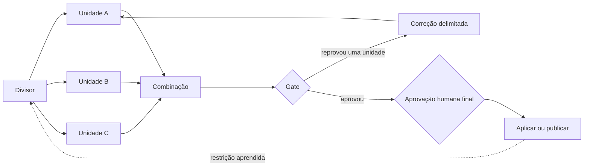
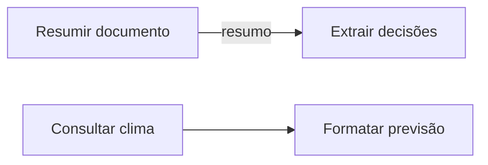
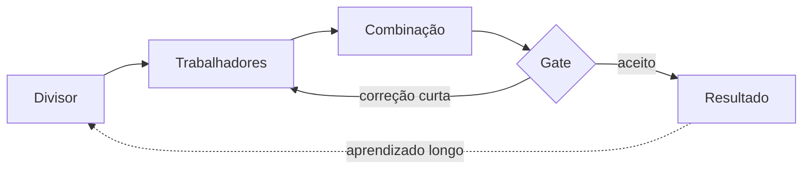

# Loops e grafos para agentes de IA: verificação, paralelismo e aprovação final

Este tutorial adapta o artigo [“Loops and Graphs”, de Hanako](https://x.com/hanakoxbt/status/2091515787366306154), para um fluxo que você pode desenhar antes de automatizar. A ideia central é separar dois problemas:

- o **loop** melhora uma unidade de trabalho até ela passar numa verificação;
- o **grafo** decide quais unidades existem, quais dependem umas das outras e onde entram correção, aprendizado e aprovação humana.

Um loop bem construído não corrige um fluxo mal dividido. Um grafo rápido também não ajuda se cada nó entrega trabalho sem verificação. O sistema precisa dos dois.

## O que você vai construir

O exemplo será uma alteração de código dividida em unidades independentes. Cada unidade passa por produção, verificação e correção. Depois, os resultados aprovados são combinados e uma pessoa decide somente a ação de maior consequência.



O mesmo desenho serve para auditoria, pesquisa, geração de conteúdo, migração de dados e atendimento. Mudam as unidades e as verificações; a estrutura permanece.

## Conceitos básicos

| Conceito | Responsabilidade | Pergunta que responde |
|---|---|---|
| unidade | trabalho delimitado, com entrada e saída próprias | “Qual é o menor resultado verificável?” |
| loop | produzir, verificar, corrigir e repetir | “Esta unidade já está correta?” |
| nó | executar uma transformação ou decisão | “Quem ou o que faz esta etapa?” |
| aresta | transportar uma saída necessária para outro nó | “Qual dado atravessa esta ligação?” |
| gate | aceitar, devolver ou bloquear o trabalho | “A evidência permite avançar?” |
| grafo | organizar unidades, dependências e retornos | “O que executa agora, em paralelo ou depois?” |

## 1. Escolha um trabalho repetitivo

Comece com uma tarefa que você já executa e revisa com frequência. Alguns exemplos:

- atualizar várias rotas de uma API;
- pesquisar concorrentes e consolidar uma análise;
- adaptar uma campanha para diferentes canais;
- migrar módulos de um repositório;
- revisar contratos ou documentos por seção.

Descreva o resultado final e liste as partes que podem ser verificadas separadamente. Evite começar pelo número de agentes. A divisão deve seguir o trabalho, não a quantidade de executores disponível.

Exemplo:

```yaml
objetivo: migrar quatro módulos sem alterar a API pública
unidades:
  - autenticacao
  - faturamento
  - notificacoes
  - relatorios
resultado_final: testes aprovados e contrato público preservado
acao_final: integrar a mudança na branch principal
```

## 2. Escreva a condição de aprovação antes do agente

Um loop só existe quando alguma verificação pode reprovar o resultado. “Parece bom”, “o agente está confiante” e “não apareceu erro” não são condições suficientes.

Prefira condições observáveis:

| Fraca | Verificável |
|---|---|
| o código parece correto | o teste definido termina com código `0` |
| a pesquisa está completa | cada afirmação possui fonte e data |
| a edição ficou boa | o arquivo respeita o schema e o diff permitido |
| nada falhou | a saída esperada foi comparada com o resultado obtido |

Registre a verificação como dados:

```yaml
check:
  comando: "pytest tests/test_auth.py"
  aprovacao:
    exit_code: 0
    arquivos_permitidos:
      - src/auth.py
      - tests/test_auth.py
  tentativas_maximas: 3
```

O comando é apenas um exemplo. Em outro domínio, a verificação pode ser um schema JSON, uma consulta SQL somente leitura, uma lista de fontes obrigatórias ou uma revisão humana estruturada.

Quando usar um modelo como avaliador, combine sua avaliação com provas que ele não controla. Um segundo modelo pode encontrar falhas sem ser a autoridade única para liberar uma ação.

## 3. Divida o trabalho pelas diferenças relevantes

Uma divisão ruim cria agentes que repetem a mesma análise. Em uma auditoria de código, separar somente por pasta pode fazer vários agentes revisarem os mesmos arquivos compartilhados. Separar por risco ou superfície afetada tende a produzir visões diferentes.

Use estes critérios:

1. cada unidade tem uma entrada identificável;
2. cada unidade produz uma saída própria;
3. o escopo de arquivos, registros ou canais é explícito;
4. uma falha pode devolver apenas aquela unidade;
5. o resultado pode ser combinado sem reexecutar as demais.

Exemplo de divisão por superfície:

```yaml
- id: autenticacao-e-sessoes
  arquivos: ["src/auth/**", "tests/auth/**"]
  lente: seguranca-e-compatibilidade

- id: persistencia-e-migracoes
  arquivos: ["src/db/**", "migrations/**"]
  lente: integridade-e-reversibilidade

- id: contratos-publicos
  arquivos: ["src/api/**", "openapi.yaml"]
  lente: compatibilidade-de-interface
```

## 4. Desenhe somente dependências reais

Para cada seta, pergunte: **qual variável produzida pelo nó anterior é consumida pelo próximo?**

Se você não consegue nomear esse dado, provavelmente não existe dependência. A ordem veio do roteiro escrito, não do trabalho real.



“Resumir documento” e “consultar clima” podem começar juntos. “Extrair decisões” precisa esperar pelo resumo porque consome essa saída.

Faça uma tabela antes de implementar:

| Origem | Destino | Dado transportado | Dependência real? |
|---|---|---|---|
| divisor | trabalhador A | unidade A + escopo | sim |
| trabalhador A | combinação | resultado A + evidências | sim |
| trabalhador A | trabalhador B | nenhum | não |
| combinação | gate | conjunto consolidado | sim |

Eliminar esperas sem dado compartilhado costuma ser a forma mais simples de reduzir a duração do fluxo.

## 5. Use quatro tipos de nó

O vocabulário do artigo pode ser reduzido a quatro papéis:

| Tipo | Implementação comum | Função |
|---|---|---|
| divisor | modelo ou código | transformar o objetivo em unidades delimitadas |
| trabalhador | modelo com ferramentas | executar uma unidade sob uma lente específica |
| nó de código | função determinística | combinar, ordenar, deduplicar, comparar ou validar |
| gate | código, modelo com evidências ou pessoa | aceitar, devolver ou bloquear |

Use código quando existe uma única transformação correta. Combinar JSON, calcular hashes, comparar listas, aplicar um schema e ordenar resultados não exigem raciocínio de um modelo.

Uma regra prática: se a transformação pode ser descrita sem verbos como julgar, decidir, avaliar ou sintetizar, tente implementá-la como código.

## 6. Isole o contexto de cada trabalhador

Cada trabalhador deve receber somente:

- a unidade atribuída;
- o objetivo comum necessário;
- o escopo permitido;
- a condição de aprovação;
- as ferramentas indispensáveis;
- o formato da saída.

Evite colocar todos os trabalhadores na mesma janela de contexto. Quando um lê as conclusões preliminares dos outros, as análises tendem a convergir antes da comparação. Você paga por várias execuções e recebe variações da primeira opinião.

Contrato de entrada:

```json
{
  "unit_id": "auth-redirect",
  "objective": "preservar o redirecionamento após login",
  "allowed_paths": ["src/auth.py", "tests/test_auth.py"],
  "check": "pytest tests/test_auth.py",
  "attempt": 1,
  "max_attempts": 3
}
```

Contrato de saída:

```json
{
  "unit_id": "auth-redirect",
  "status": "candidate",
  "changed_paths": ["src/auth.py"],
  "evidence": {
    "command": "pytest tests/test_auth.py",
    "exit_code": 0
  }
}
```

## 7. Coloque o loop dentro do nó

O loop corrige uma unidade. O grafo coordena unidades diferentes.

```text
para cada unidade:
    produzir candidato
    executar verificação

    enquanto reprovado e tentativas < limite:
        devolver motivo, evidência e escopo
        corrigir somente a unidade
        executar a mesma verificação

    se ainda reprovado:
        escalar o problema de planejamento
```

Defina um limite. Três tentativas é a heurística proposta no artigo, não uma constante universal. Se uma unidade falha repetidamente com a mesma especificação, interrompa o loop e revise a divisão, os dados de entrada ou o próprio critério.

## 8. Devolva a unidade que falhou

Se uma de quatro unidades falhar, não devolva o lote inteiro. Reexecutar unidades corretas aumenta custo, cria variações e obriga o gate a verificar tudo outra vez.

Uma devolução deve carregar:

```yaml
unit_id: auth-redirect
veredito: reprovado
motivo: resposta HTTP diferente do contrato
evidencia:
  esperado: 302
  observado: 200
  origem: tests/test_auth.py
escopo_permitido:
  - src/auth.py
tentativa: 2
tentativas_maximas: 3
```

O `escopo_permitido` impede a correção de crescer. Sem ele, o agente pode encontrar problemas adjacentes e transformar um reparo localizado em um diff amplo que ninguém aprovou.

## 9. Crie dois caminhos de retorno

Um pipeline segue em frente e esquece. Um grafo que melhora precisa de dois retornos com destinos diferentes.



### Retorno curto: corrigir esta execução

O gate devolve uma unidade ao trabalhador com motivo, evidência, escopo e orçamento de tentativas. Esse retorno resolve o problema atual.

### Retorno longo: melhorar execuções futuras

Um resultado aceito pode revelar uma restrição que deve chegar ao divisor na próxima execução:

```yaml
resultado_aceito: adaptador preservou compatibilidade
restricao_derivada: manter argumentos nomeados sem renomear
aplica_se_a: toda unidade que altere adaptadores
origem: run-2026-09-12/unit-adapters
aprovado_por: gate-de-compatibilidade
```

Grave somente restrições derivadas de resultados aceitos e com origem rastreável. Não transforme uma conclusão provisória do agente em regra permanente.

## 10. Abra o gate conforme o impacto

A confiança declarada pelo modelo deve ser um sinal secundário. O critério principal é o custo de uma decisão errada e a dificuldade de desfazê-la.

| Faixa | Exemplos | Decisão do gate |
|---|---|---|
| reversível e contida | copy, teste, função isolada com cobertura | pode avançar com verificações determinísticas |
| reversível e ampla | utilitário compartilhado, schema aditivo, mudança com muitos consumidores | exige verificações e trajetória limpa |
| difícil de reverter | exclusão, migração destrutiva, produção, dinheiro | permanece fechada até aprovação humana |

Dentro de uma faixa automatizável, avalie as evidências nesta ordem:

1. resultados determinísticos;
2. trajetória da execução, incluindo tentativas e mudanças de escopo;
3. histórico de rollback daquele nó ou tipo de unidade;
4. avaliação do modelo.

Uma faixa fechada não é um limiar de confiança muito alto. Ela exige uma decisão humana por causa da consequência.

## 11. Posicione a pessoa no ponto certo

Coloque a aprovação humana onde a consequência é maior e a reversão é mais difícil:

- aprovar o conjunto final;
- escolher quais mudanças serão aplicadas;
- liberar publicação, migração, exclusão ou transação;
- decidir quando um plano deve ser redesenhado.

Se a pessoa precisa revisar cada saída intermediária, ela virou o nó mais lento do grafo. Melhore os gates anteriores até que a revisão humana receba um pacote pequeno, consolidado e acompanhado das evidências.

## 12. Ordem recomendada de implementação

1. Escolha um trabalho repetitivo e um resultado final observável.
2. Escreva primeiro a condição que pode reprovar o resultado.
3. Defina as unidades e o escopo de cada uma.
4. Desenhe somente as arestas que transportam dados reais.
5. Implemente os trabalhadores e seus loops locais.
6. Adicione combinação determinística e um gate.
7. Faça o gate devolver apenas a unidade reprovada.
8. Registre trajetória, tentativas, evidências e rollbacks.
9. Posicione a aprovação humana conforme impacto e reversibilidade.
10. Adicione o retorno de aprendizado depois que os resultados aceitos forem confiáveis.

## Exemplo completo: migração de quatro módulos

### Desenho

```text
Objetivo
  ↓
Divisor por superfície de impacto
  ├─ unidade autenticação ─ loop local ─┐
  ├─ unidade faturamento ─ loop local ─┤
  ├─ unidade notificações ─ loop local ┤─ combinação ─ gate
  └─ unidade relatórios ─ loop local ──┘                 │
                                                        ├─ devolver unidade reprovada
                                                        └─ pedir aprovação para integrar
```

### Gate

```yaml
gate:
  exige:
    - testes_da_unidade_aprovados
    - nenhum_arquivo_fora_do_escopo
    - contrato_publico_preservado
    - evidencias_presentes
  bloqueia:
    - migracao_destrutiva_sem_aprovacao
    - segredo_no_diff
    - mais_de_tres_tentativas
```

### Pacote entregue à pessoa

```yaml
decisao_solicitada: integrar_mudancas
unidades:
  aprovadas: 4
  reprovadas: 0
evidencias:
  testes: aprovados
  escopo: preservado
  contrato_publico: preservado
risco:
  reversibilidade: alta
  alcance: amplo
rollback: "reverter o commit de integração"
```

A pessoa revisa a decisão e suas consequências, sem reler quatro conversas de agentes.

## Aplicação com Codex e OpenAI Agents SDK

Em uma sessão interativa do Codex, use o desenho como contrato operacional: delegue somente unidades independentes, dê escopo próprio a cada tarefa, aplique verificações pertinentes e consolide os resultados antes da ação final. Para repetição durável, filas, estado entre execuções e gates programáticos, implemente o grafo em um runtime de orquestração.

No OpenAI Agents SDK, a documentação oficial apresenta duas formas de coordenação: decisões feitas por um agente e fluxo controlado por código. O controle por código permite encadear agentes, executar trabalhos independentes com `asyncio.gather` e usar um loop com agente executor e avaliador. Consulte [orquestração de agentes](https://openai.github.io/openai-agents-python/multi_agent/).

O mapeamento conceitual é:

| Tutorial | Agents SDK |
|---|---|
| trabalhador especializado | agente usado como ferramenta ou agente após handoff |
| execução paralela | primitivas assíncronas do Python |
| loop de produção e avaliação | chamadas repetidas de executor e avaliador controladas por código |
| gate de entrada ou saída | guardrail ou verificação própria da aplicação |
| aprovação de ação sensível | interrupção human-in-the-loop |
| trajetória | tracing, estado e registros da aplicação |

Guardrails têm limites de aplicação. Segundo a [documentação de guardrails](https://openai.github.io/openai-agents-python/guardrails/), os guardrails de entrada atuam no primeiro agente da cadeia e os de saída no agente final; verificações por chamada de função exigem tool guardrails ou lógica própria. Portanto, não presuma que um único guardrail final verificou cada nó intermediário.

Para ações sensíveis, o fluxo [human-in-the-loop](https://openai.github.io/openai-agents-python/human_in_the_loop/) permite pausar a execução, expor a chamada pendente, aprovar ou rejeitar e retomar o estado. A regra de impacto deste tutorial deve ser implementada pela aplicação; o SDK fornece o mecanismo de interrupção.

## Erros comuns

| Erro | Efeito | Correção |
|---|---|---|
| escrever o agente antes do check | saída convincente sem condição de reprovação | defina o contrato e o gate primeiro |
| transformar toda ordem em dependência | execução serial desnecessária | nomeie o dado que atravessa cada aresta |
| usar modelo para toda transformação | mais custo, latência e variância | use código em operações determinísticas |
| compartilhar contexto entre trabalhadores | análises convergem cedo | dê contexto e escopo próprios |
| devolver o lote inteiro | trabalho correto é refeito | devolva somente a unidade reprovada |
| corrigir sem limite de escopo | a mudança cresce sem revisão | envie caminhos ou registros permitidos |
| repetir indefinidamente | custo cresce sem rever o plano | limite tentativas e escale ao divisor |
| gate baseado em autoconfiança | o executor influencia a própria liberação | priorize evidência e impacto |
| esquecer o retorno longo | o sistema repete os mesmos erros | grave restrições aceitas com origem |
| pedir aprovação em cada etapa | a pessoa vira gargalo | aprove a ação de maior consequência |

## Checklist de prontidão

- [ ] O resultado final possui uma condição observável de sucesso.
- [ ] Cada unidade tem entrada, saída, escopo e check próprios.
- [ ] Cada aresta transporta um dado nomeado.
- [ ] Unidades sem dependência podem executar em paralelo.
- [ ] Transformações determinísticas usam código.
- [ ] Cada loop tem limite de tentativas.
- [ ] O retorno contém motivo, evidência e escopo permitido.
- [ ] Uma falha devolve somente a unidade afetada.
- [ ] Restrições permanentes vêm de resultados aceitos e têm origem.
- [ ] O gate considera alcance e reversibilidade.
- [ ] Ações difíceis de reverter exigem aprovação humana.
- [ ] A trajetória permite explicar por que o gate aprovou ou bloqueou.

## Três regras para revisar o desenho

1. Meça o caminho percorrido, incluindo tentativas, devoluções e mudanças de escopo, além do resultado final.
2. Um veredito só funciona como gate quando muda a próxima transição do grafo; se nada muda, ele é apenas um relatório.
3. Toda falha precisa alimentar uma correção da execução atual ou uma restrição aprovada para execuções futuras.

## Limites da fonte

- O artigo do X foi consultado como uma peça completa, incluindo os quatro diagramas incorporados.
- As recomendações do autor são princípios de projeto e heurísticas; o artigo não apresenta benchmark reproduzível nem uma implementação de referência.
- O limite de três tentativas e a quantidade sugerida de trabalhadores devem ser ajustados ao custo, ao risco e ao domínio.
- Os diagramas deste tutorial foram redesenhados em Mermaid e os exemplos foram adaptados para português; eles não são cópias dos materiais visuais da fonte.
- O curso externo mencionado pelo autor não foi necessário para produzir este tutorial.

## Fontes

- [Artigo original de Hanako no X](https://x.com/hanakoxbt/status/2091515787366306154)
- [Agent orchestration — OpenAI Agents SDK](https://openai.github.io/openai-agents-python/multi_agent/)
- [Guardrails — OpenAI Agents SDK](https://openai.github.io/openai-agents-python/guardrails/)
- [Human-in-the-loop — OpenAI Agents SDK](https://openai.github.io/openai-agents-python/human_in_the_loop/)
