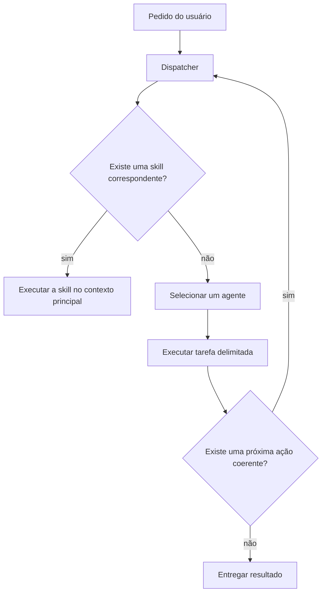

# My Brain Is Full Crew: equipe de agentes para organizar um vault do Obsidian

O [My Brain Is Full — Crew](https://github.com/gnekt/My-Brain-Is-Full-Crew) é
um sistema de agentes e skills que trabalha diretamente em um vault do
Obsidian. Você conversa com o agente no Codex, Claude Code, Gemini CLI ou
OpenCode; um dispatcher identifica a intenção e encaminha o trabalho para o
componente adequado.

O checkout consultado foi o commit
`238ae8c45301cc1ad8ef338288720cee1f0ada93`. Ele contém oito agentes centrais,
quatorze skills, adaptadores para quatro plataformas, scripts de instalação,
hooks, referências compartilhadas e integrações MCP opcionais.


## O que o sistema resolve

A proposta é permitir que a conversa seja a interface principal do vault. Em
vez de navegar manualmente por pastas para cada operação, você pode pedir:

- salvar uma ideia ou anotação desorganizada;
- classificar as notas da inbox;
- localizar decisões e informações com referências;
- criar ligações entre notas;
- encontrar duplicações, links quebrados e conteúdo abandonado;
- transformar gravações e transcrições em notas estruturadas;
- preparar reuniões, prazos e agenda semanal;
- criar agentes personalizados para necessidades recorrentes.

O sistema não substitui o Obsidian. Os arquivos Markdown continuam sendo o
estado durável. Os agentes leem e escrevem nesse conjunto de arquivos, enquanto
o dispatcher coordena quem executa cada tipo de tarefa.

## Os oito agentes centrais

| Agente | Responsabilidade |
|---|---|
| **Architect** | configura a estrutura do vault, conduz o onboarding e cria agentes personalizados |
| **Scribe** | transforma texto livre e despejos mentais em notas organizadas |
| **Sorter** | classifica a inbox e encaminha cada nota ao destino adequado |
| **Seeker** | pesquisa o vault e sintetiza respostas com referências às notas |
| **Connector** | encontra relações, cria wikilinks e analisa o grafo de conhecimento |
| **Librarian** | verifica estrutura, duplicações, links, frontmatter e manutenção do vault |
| **Transcriber** | processa gravações, aulas, podcasts e reuniões |
| **Postman** | conecta email, calendário, reuniões, contatos e prazos |

Os agentes cuidam de operações delimitadas. Fluxos que precisam conversar com
o usuário por várias etapas ficam nas skills.

## As quatorze skills

| Skill | Uso |
|---|---|
| `/onboarding` | configurar o vault e as preferências iniciais |
| `/create-agent` | criar um agente personalizado por entrevista guiada |
| `/manage-agent` | listar, editar ou remover agentes personalizados |
| `/defrag` | reorganização estrutural periódica em cinco fases |
| `/email-triage` | classificar emails não lidos e registrar itens relevantes |
| `/meeting-prep` | produzir um briefing com notas, participantes e mensagens relacionadas |
| `/weekly-agenda` | reunir compromissos, emails e tarefas da semana |
| `/deadline-radar` | formar uma linha do tempo de prazos por urgência |
| `/transcribe` | converter áudio ou transcrição em nota estruturada |
| `/vault-audit` | auditar estrutura, duplicações, links, frontmatter e MOCs |
| `/deep-clean` | fazer uma limpeza mais extensa do vault |
| `/tag-garden` | analisar tags ausentes, duplicadas ou pouco úteis |
| `/inbox-triage` | processar e arquivar as notas da inbox |
| `/contact-sync` | pesquisar, criar ou completar contatos no Apple Contacts |

## Como o roteamento funciona



O dispatcher verifica primeiro as skills. Se nenhuma corresponder ao pedido,
ele consulta a tabela de agentes. A resposta de um agente pode sugerir uma ação
do Architect, Connector, Sorter ou Librarian, mas a coordenação volta ao
contexto principal antes da próxima execução.

No adaptador do Codex, isso foi ajustado para o limite de profundidade de
subagentes. O contexto raiz decide cada delegação; um agente filho executa uma
tarefa delimitada e retorna o resultado antes de qualquer etapa seguinte.

## Como o sistema se adapta ao seu vault

O projeto usa `Meta/vault-map.md` para mapear funções lógicas a pastas reais. Os
agentes trabalham com tokens como:

```text
{{inbox}}
{{projects}}
{{areas}}
{{resources}}
{{archive}}
{{people}}
{{meetings}}
{{daily}}
{{templates}}
{{meta}}
{{moc}}
```

Durante o onboarding, o Architect identifica ou cria os destinos equivalentes.
O modelo inicial é uma combinação de PARA e Zettelkasten:

```text
00-Inbox/
01-Projects/
02-Areas/
03-Resources/
04-Archive/
05-People/
06-Meetings/
07-Daily/
MOC/
Templates/
Meta/
```

Um vault existente não precisa usar esses nomes. O mapa evita que os prompts
dependam de uma única estrutura física.

## Antes de instalar

Você precisa de:

- um vault do Obsidian disponível localmente;
- Git;
- uma das plataformas compatíveis;
- Bash para executar os scripts do projeto;
- backup atual do vault antes da primeira instalação;
- leitura e aceitação dos arquivos `TERMS_OF_USE.md` e
  `docs/DISCLAIMERS.md`.

O instalador não possui modo `--dry-run`. Se detectar `.codex/`, `.claude/`,
`.opencode/`, `.gemini/`, `AGENTS.md`, `CLAUDE.md` ou `GEMINI.md`, ele informa
que existem arquivos de uma instalação anterior e pede para continuar ou sair.

Em um vault importante, teste primeiro em uma cópia. O instalador afirma não
alterar as notas do usuário, mas instala ou atualiza arquivos operacionais no
nível raiz do vault.

## Instalação para Codex

### 1. Clone o repositório dentro do vault

```bash
cd "/caminho/do/seu-vault"
git clone https://github.com/gnekt/My-Brain-Is-Full-Crew.git
cd My-Brain-Is-Full-Crew
```

### 2. Execute o adaptador do Codex

```bash
bash scripts/launchme.sh \
  --platform codex-cli \
  --target "/caminho/do/seu-vault"
```

O argumento `--target` evita depender da detecção do diretório pai e deixa o
destino explícito.

### 3. Confira os arquivos instalados

O vault deve receber:

```text
seu-vault/
├── AGENTS.md
├── .codex/
│   ├── agents/
│   ├── references/
│   ├── hooks/
│   └── config.toml
├── .agents/
│   └── skills/
├── Meta/
│   ├── scripts/
│   └── states/
└── My-Brain-Is-Full-Crew/
```

No Codex:

- `AGENTS.md` funciona como dispatcher do projeto;
- `.codex/agents/*.toml` contém os oito agentes;
- `.agents/skills/` contém as quatorze skills;
- `.codex/references/` guarda os contratos compartilhados;
- `.codex/config.toml` define MCPs e configurações locais do vault;
- `Meta/scripts/` recebe os comandos auxiliares da orquestra.

A configuração em `<vault>/.codex/config.toml` é local ao projeto. Ela é
separada da configuração pessoal em `~/.codex/config.toml`.

### 4. Abra o Codex no diretório do vault

```bash
codex -C "/caminho/do/seu-vault"
```

Depois peça:

```text
Inicialize meu vault.
```

Ou execute a skill diretamente:

```text
/onboarding
```

O onboarding coleta idioma, função, motivo de uso, áreas da vida que devem ser
organizadas, agentes desejados e integrações opcionais. Ao final, o Architect
cria `Meta/vault-map.md`, perfil, estrutura, templates e estados necessários.

## Instalação em outras plataformas

```bash
# Claude Code
bash scripts/launchme.sh --platform claude-code --target "/caminho/do/vault"

# Gemini CLI
bash scripts/launchme.sh --platform gemini-cli --target "/caminho/do/vault"

# OpenCode
bash scripts/launchme.sh --platform opencode --target "/caminho/do/vault"
```

Cada adaptador converte dispatcher, agentes, skills, referências, hooks e MCPs
para os caminhos e formatos esperados pela plataforma.

## Exemplos de uso

### Capturar uma nota

```text
Salve isto: conversei com Ana sobre o orçamento do terceiro trimestre e ela
precisa do relatório até sexta-feira.
```

O Scribe deve criar uma nota com contexto, tarefas, prazo e links adequados.

### Pesquisar o vault

```text
O que decidimos sobre a estratégia de preços? Responda citando as notas.
```

O Seeker procura os arquivos relacionados e devolve uma síntese com origem.

### Processar a inbox

```text
/inbox-triage
```

O fluxo classifica as notas, extrai ações, atualiza MOCs e produz um resumo.

### Fazer manutenção

```text
/vault-audit
```

O Librarian verifica estrutura, duplicações, links, frontmatter, MOCs e gera
um relatório de integridade do vault.

### Criar um agente personalizado

```text
/create-agent
```

O Architect conduz uma entrevista sobre finalidade, entradas, saídas,
gatilhos, acesso necessário e limites. O novo agente passa a integrar o
registro da equipe.

## Integrações externas

O Postman e algumas skills podem usar Gmail, Google Calendar, Apple Contacts ou
Hey.com. A presença de arquivos MCP não significa que essas contas estejam
conectadas.

Depois da instalação, verifique no Codex:

```bash
codex -C "/caminho/do/seu-vault" mcp list
```

Cada serviço ainda pode exigir credenciais, OAuth, aplicativo auxiliar ou
permissões do sistema. Configure somente as integrações que realmente serão
usadas.

## Verificação básica

Primeiro, confirme a descoberta dos componentes sem pedir alterações no vault:

```bash
codex exec -C "/caminho/do/seu-vault" \
  "Liste os agentes em .codex/agents, as skills em .agents/skills e o arquivo dispatcher deste workspace."
```

Depois, faça testes delimitados:

```text
@Seeker Liste as notas relacionadas a este projeto, sem alterar arquivos.
```

```text
@Librarian Faça apenas uma verificação rápida e apresente os problemas antes de
corrigi-los.
```

Quando o vault já tiver uma cópia de segurança, teste a escrita com uma nota
sintética e confira o arquivo Markdown criado.

## Atualização

```bash
cd "/caminho/do/seu-vault/My-Brain-Is-Full-Crew"
git pull
bash scripts/updateme.sh --platform codex-cli
```

O atualizador recompila o adaptador e propaga as versões novas. Agentes
personalizados não devem ser removidos, mas arquivos centrais podem ser
atualizados. Confira o diff e o backup do vault antes de aceitar uma atualização
importante.

## Privacidade e limites

- O sistema trabalha com arquivos pessoais do vault e pode acessar emails,
  calendário, contatos ou transcrições quando essas integrações são ativadas.
- O usuário continua responsável por consentimento e proteção de dados de
  terceiros presentes nesses materiais.
- As respostas são geradas por modelos e podem conter erros. Uma referência à
  nota não comprova que a interpretação esteja correta.
- Agentes personalizados podem produzir conteúdo em saúde, finanças, direito
  ou outros domínios regulados, mas isso não os transforma em profissionais.
- O projeto declara que recursos de alimentação, bem-estar ou suporte emocional
  não são dispositivos médicos, terapia ou atendimento profissional.
- Em decisões importantes, valide a informação com a fonte e consulte um
  profissional qualificado quando a área exigir.

No checkout consultado, os arquivos `agents/` contêm os oito agentes centrais
listados neste tutorial. Alimentação e bem-estar aparecem como áreas opcionais
e possíveis agentes personalizados, acompanhados de avisos específicos; eles
não formam agentes centrais adicionais no diretório atual.

## Referências

- [Repositório oficial](https://github.com/gnekt/My-Brain-Is-Full-Crew)
- [Guia inicial](https://github.com/gnekt/My-Brain-Is-Full-Crew/blob/main/docs/getting-started.md)
- [Guia para Codex CLI](https://github.com/gnekt/My-Brain-Is-Full-Crew/blob/main/docs/codex-cli.md)
- [Mapeamento do vault](https://github.com/gnekt/My-Brain-Is-Full-Crew/blob/main/docs/vault-mapping.md)
- [Avisos e limitações](https://github.com/gnekt/My-Brain-Is-Full-Crew/blob/main/docs/DISCLAIMERS.md)
- [Termos de uso](https://github.com/gnekt/My-Brain-Is-Full-Crew/blob/main/TERMS_OF_USE.md)
